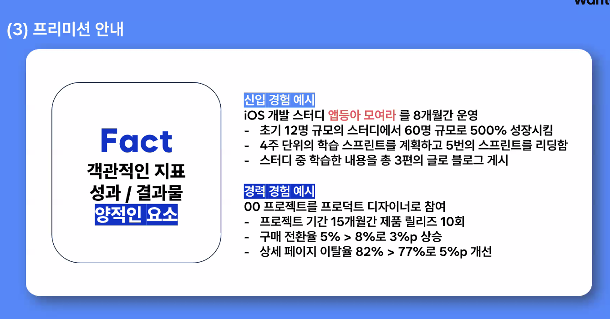
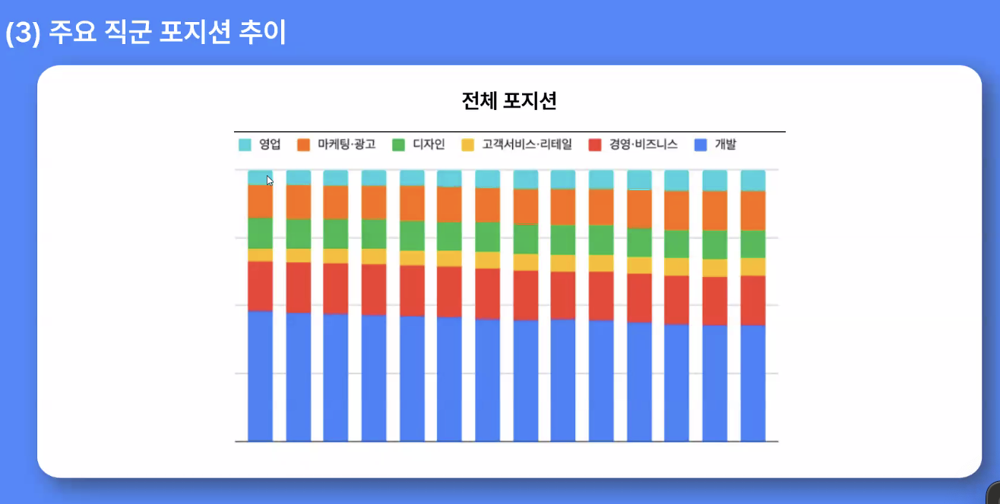
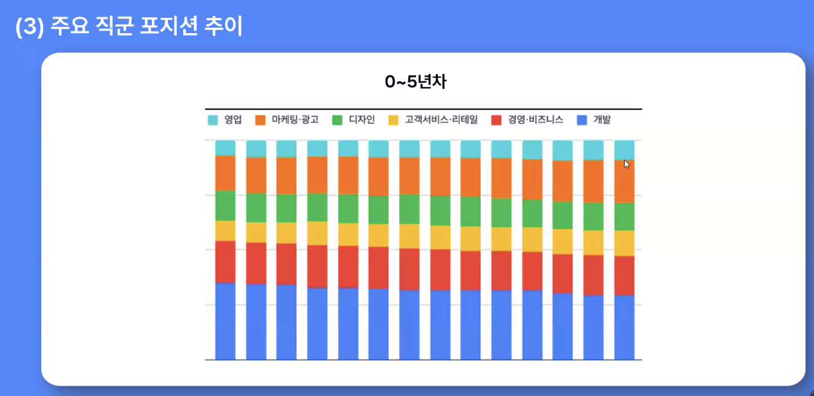
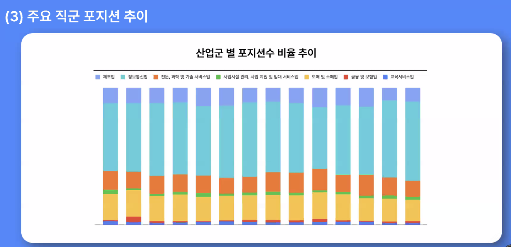
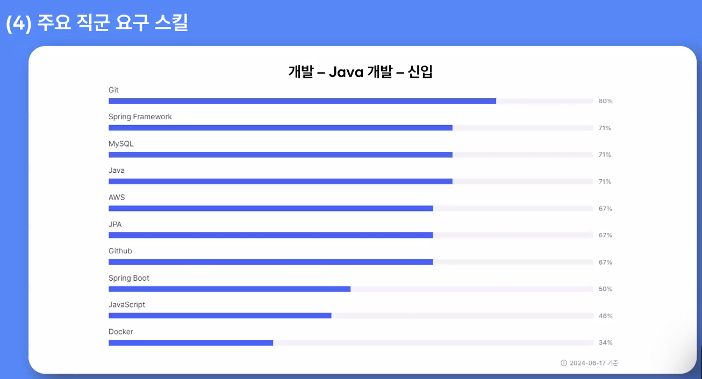
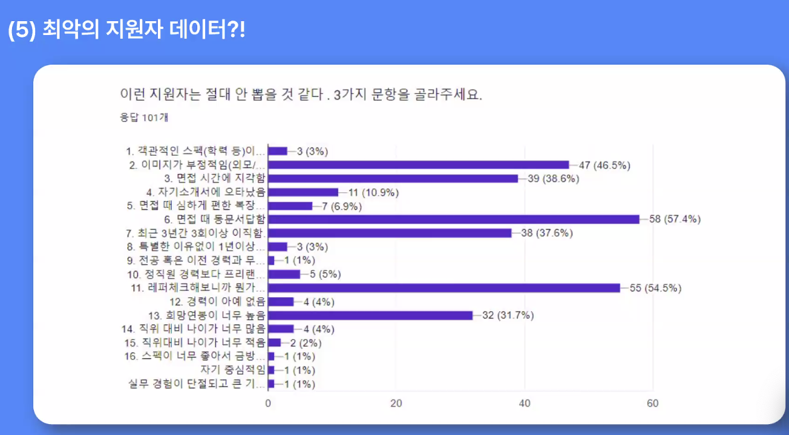
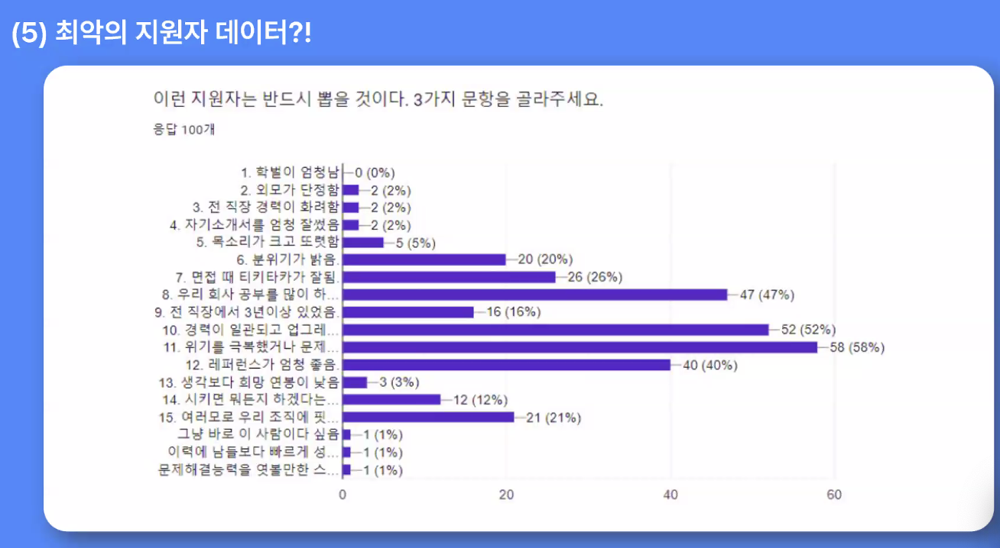

## Dev Diary (2024.06)

### 2024.06.03

- 2024 ASE (USA) 논문 수정
    - 수정해야할 사항
        - 2. 관련 연구
            - JAWS와 같은 상용 스크린 리더와 비교하지 않는다.
            
        - 3. 본론
            - 몇 가지 일반적인 다이어그램 유형(예: 벤)에 대해 구체적으로 언급하지 않는다.
            - 논문은 다양한 기술과 API의 사용을 언급하지만 이러한 기술이 어떻게 통합되는지 또는 전체 시스템 성능에 어떻게 기여하는지에 대해서는 자세히 설명하지 않는다.
            - 이 논문은 특정 구현에 초점을 맞추고 이론적 깊이가 부족하여 그 매력을 제한하고 있습니다.
            - 명시된 동기에도 불구하고 이 시스템의 설계, 구축 및 평가 과정에서 시각 장애인 커뮤니티와 협의하거나 더 잘 참여했다는 증거는 이 논문에서 찾아볼 수 없습니다.

        - 4. 평가
            - 4-1. 정성적 평가
                - 평가 섹션의 예가 잘못 선택되어 응용 프로그램의 잠재력을 보여주지 않습니다.
                - 시스템 평가가 엄격하지 않다. 이해도와 만족도가 높아졌다는 주장을 뒷받침하는 명확한 방법론이나 통계 분석이 제공되지 않습니다.
                - 평가 단계에서는 시각장애인 들과의 협력이 이루어졌음을 보여 주어야 합니다. 이 논문에서는 평가 주기에 누가 참여했으며 이 평가가 정확히 어떻게 수행되었는지는 불분명합니다.

            - 4-2. 정량적 평가
                - 리소스 제약(예: 결과물을 생성하는 데 걸리는 시간)에 대한 언급이 없다.
    - 리뷰에서 제안한 보완할 점
        - 강의 동영상에 대한 구체적인 구현과 초점이 독창성을 더할 수 있다.
        - 시스템 아키텍처와 구현에 대한 보다 자세한 설명을 제공하세요. 다양한 기술 및 API의 통합을 포함하여 시스템 아키텍처 및 구현에 대한 자세한 설명을 제공하세요.
        - 다음을 포함한 명확한 방법론을 제공하여 평가 섹션을 강화하세요. 참여자 선정, 평가 과제 설계 및 결과의 통계적 분석 등 명확한 방법론을 제공하여 평가 부분을 강화합니다.

### 2024.06.18

- 이력서 작성
    - 경험 정리가 필요
        - 지금껏 겪어온 모든 경험들을 이력서의 재료로 만들어보고자 함
        - 음식 재료를 어떻게 사용하느냐에 따라 샌드위치가 되기도, 파스타가 되기도 하면서 정리된 경험은 필요하다
        - (마인드맵 작성 어플 존재)
    - 다양한, 다수의, 이런 말 쓰지 말기!
    - Fact와 Lesson
        - Fact
            - 객관적인 지표
            - 성과, 결과물 등 양적인 요소
        -
        - Lesson
            - Fact를 통해 깨달은 점, 후회한 점, 인사이트
                - 인사이트가 무엇..?
            - 질적인 요소
      

    - <h1> 프리 미션

    - <h2> Fact </h2> 

        - 시각장애인 강의 동영상 자동 해설 어플리케이션 개발 정부 과제를 2년간 운영 및 개발
            - 해외 학회 2개에서 논문 채택, scopus급 논문 출판 완료, 논문 발표함
                - 방콕 ISBM 2023, 런던 ICICT 2024에서 논문 출판 완료
                - 논문 실물 저장하고 있기, 논문이 어느정도의 급인지 인지하고 있기
            - 이 외에도 학위 논문, sci저널 논문 작성 완료
            - 개발된 앱으로 2년 동안 산업체 프리젠테이션 진행, 피드백 받아 디벨롭함
    - <h2> Lesson</h2>

        - 시각장애인 강의 동영상 자동 해설 어플리케이션 개발 정부 과제를 2년간 운영 및 개발
            - 한명 혹은 2명으로 프로젝트 하나를 유지하는 것에는 어려움이 있다는 것을 알게 되었다.
            - 실제 사용자가 앱을 사용해보는 것과 개발자가 디자인하고 생각한 것과는 사용성에서 차이가 있다는 것을 알게 됨
            - 하나의 앱을 완성하고 배포하기 위해서는 너무나 많은 단계들이 있으며, 많은 사람들이 협업 및 분업해서 일을 하는것이 얼마나 중요한 것인지 알게 되었다.

      

- 회사에 기술블로그가 있는지 보고 가기! (2명 이상인지 보기)
- 시각장애인 강의 동영상 자동 해설 어플리케이션 개발 정부 과제를 2년간 운영 및 개발
- 공채보다는 수시채용의 비중이 늘었다
    - 업무에 필요한 인원을 그 시기에 맞춰서 뽑는 느낌
    - 규모가 적고 탈락도 많이 한다.
    - 떨어진 곳 또 내도 좋음 (바뀌는 부분이 있어야함)
    - 3대 그룹 신입 공채 폐지, 수시 채용으로
        - sk, 현대 자동차, lg
- 정규직에서 채용 전환형(인턴)으로 
    - lg cns나 은행권에서 인턴십 활발
    - 체험형과 채용형은 다름
- 증권사가 개발직이 많은 일을 할 수 있음

- 넣기 전까지 어렵지 넣고나면 좋아용
- 할수있어용
- 산업을 좀 더 폭넓게 보는 것이 좋다
    - 회사 홈페이지 계열사들을 다 보기
    - 내가 가장 많이 사용하고 있는 어플이 어디 회사껀지 보기
    
- 토스 유튜브 찾아봐보기!
- 스타트업 재무표! The vc, 다트
    - the vc보면 해당회사가 얼마 투자를 받고 있고, 어떤 회사가 preA인지 series 투자를 받는지 현황 볼 수 있음 (스타트업)
    - 다트는 기업정보 볼 수 있음
- 본인이 관심있는 산업, 직무를 뉴스에 쳐보기
- 
- 
- 원티드 특성상 개발직군이 많을 수 있음

- 

- 
- 다 잘할 필요는 없음
- 중요한건 기세다!
- 원티드 최신 채용 트렌드에 정보 많이 나와있음
- 원티드 ai로 면접 질문이나 채용 기업 알아볼 수 있음
    - https://www.wanted.co.kr/discovery?job=518&subJob=669&annual=3-4

- 포트폴리오는 lesson이 많이 들어간
- 이력서는 fact를 많이 쓴다.
    - 이력서는 명료하게
- 성과 -> 액션 -> 기술

- 

- 
- 지원하는 회사에 대해 공부하고 가야함!

- https://velog.io/@profoundsea25/%EC%A3%BC%EB%8B%88%EC%96%B4-%EB%B0%B1%EC%97%94%EB%93%9C-%EA%B0%9C%EB%B0%9C%EC%9E%90-%EC%B9%B4%EC%B9%B4%EC%98%A4%EB%B1%85%ED%81%AC-%ED%95%A9%EA%B2%A9-%ED%9A%8C%EA%B3%A0
- 