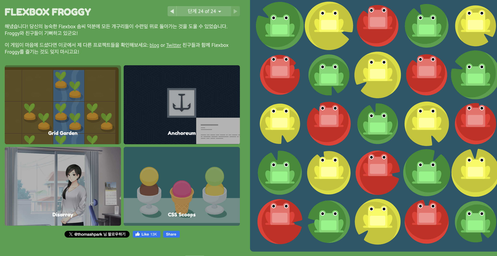

# [HTML] CSS Flex

- [CSS Float란](#css-float이란)
- [Clearfix](#clearfix)
- [Clear 속성](#clear-속성)
- [Clearfix VS Clear](#clearfix-vs-clear-속성)
- [Float 사용시 주의사항](#float-사용-시-주의사항)
- [결론](#결론)

---

## Flex(Flexbox)

- Flexbox(Flexible Box Layout Module)
- 컨테이너 내의 아이템 간 공간 배분과 정렬 기능을 제공하는 1차원 레이아웃 모델
- 주로 행이나 열 단위로 작동하며, 복잡한 계산 없이도 요소들의 크기와 순서를 유연하게 배치할 수 있음

- 장점
  - 복잡한 레이아웃을 간단하게 구현
  - 컨테이너 내 요소의 크기가 불명확하거나 동적인 경우에도 효과적으로 대응
  - 요소의 순서를 CSS로 변경할 수 있어 반응형 디자인에 유용
  - float나 Position을 사용할 때보다 코드가 간결해짐

## 주요 Flexbox 속성

CSS3 Flexbox에서 가장 많이 사용되는 **20개의 속성(property)**을 아래에 정리했습니다. 각각의 속성에 대한 간략한 설명과 함께 예제 코드를 제공합니다.

---

### **1. `display: flex`**

- Flexbox를 활성화.

```css
.container {
  display: flex;
}
```

---

### **2. `flex-direction`**

- 주축의 방향 설정.
  - `row` (기본값), `row-reverse`, `column`, `column-reverse`.

```css
.container {
  flex-direction: column;
}
```

---

### **3. `justify-content`**

- 주축에서 항목 정렬.
  - `flex-start`, `flex-end`, `center`, `space-between`, `space-around`, `space-evenly`.

```css
.container {
  justify-content: space-between;
}
```

---

### **4. `align-items`**

- 교차축에서 항목 정렬.
  - `stretch` (기본값), `flex-start`, `flex-end`, `center`, `baseline`.

```css
.container {
  align-items: center;
}
```

---

### **5. `align-content`**

- 여러 줄에서 교차축 정렬.
  - `stretch`, `flex-start`, `flex-end`, `center`, `space-between`, `space-around`.

```css
.container {
  align-content: space-around;
}
```

---

### **6. `flex-wrap`**

- 항목이 컨테이너를 초과하면 줄 바꿈 여부.
  - `nowrap` (기본값), `wrap`, `wrap-reverse`.

```css
.container {
  flex-wrap: wrap;
}
```

---

### **7. `flex`**

- 개별 항목의 크기 설정 (약어).
  - `flex: grow shrink basis;`

```css
.item {
  flex: 1 1 auto;
}
```

---

### **8. `flex-grow`**

- 남은 공간을 차지할 비율.
  - 기본값: `0`.

```css
.item {
  flex-grow: 2;
}
```

---

### **9. `flex-shrink`**

- 공간 부족 시 줄어드는 비율.
  - 기본값: `1`.

```css
.item {
  flex-shrink: 0;
}
```

---

### **10. `flex-basis`**

- 항목의 기본 크기 설정.

```css
.item {
  flex-basis: 100px;
}
```

---

### **11. `order`**

- 항목의 배치 순서.
  - 기본값: `0`.

```css
.item {
  order: 2;
}
```

---

### **12. `gap`**

- 항목 간 간격 설정.

```css
.container {
  gap: 20px;
}
```

---

### **13. `row-gap`**

- 가로축 항목 간 간격 설정.

```css
.container {
  row-gap: 15px;
}
```

---

### **14. `column-gap`**

- 세로축 항목 간 간격 설정.

```css
.container {
  column-gap: 10px;
}
```

---

### **15. `align-self`**

- 개별 항목의 교차축 정렬 설정.
  - `auto`, `flex-start`, `flex-end`, `center`, `baseline`, `stretch`.

```css
.item {
  align-self: flex-end;
}
```

---

### **16. `min-width`**

- 항목의 최소 너비.

```css
.item {
  min-width: 100px;
}
```

---

### **17. `max-width`**

- 항목의 최대 너비.

```css
.item {
  max-width: 200px;
}
```

---

### **18. `min-height`**

- 항목의 최소 높이.

```css
.item {
  min-height: 50px;
}
```

---

### **19. `max-height`**

- 항목의 최대 높이.

```css
.item {
  max-height: 150px;
}
```

---

### **20. `place-content`**

- `justify-content`와 `align-content`를 한 번에 설정.
  - `center`, `stretch`, `space-between` 등.

```css
.container {
  place-content: center;
}
```

---

### 예제: 통합 코드

```html
<div class="container">
  <div class="item">Item 1</div>
  <div class="item">Item 2</div>
  <div class="item">Item 3</div>
</div>

<style>
  .container {
    display: flex;
    flex-direction: row;
    justify-content: space-between;
    align-items: center;
    flex-wrap: wrap;
    gap: 10px;
    height: 300px;
  }
  .item {
    flex: 1 1 100px;
    align-self: stretch;
    min-width: 100px;
    max-width: 300px;
  }
</style>
```

## flex를 이용한 게임

- https://flexboxfroggy.com/#ko
- 
  - 다 깼다!
