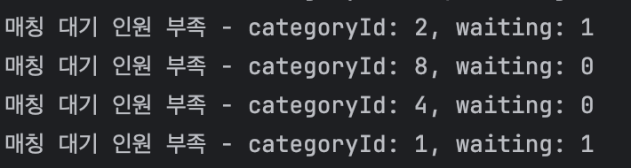
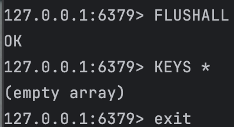
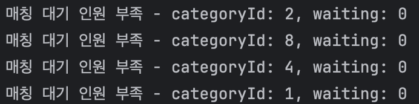

# [친구하자] WebRTC란 무엇일까?

- [1. WebRTC의 정의](#-1-webrtc의-정의)
- [2. WebRTC의 주요 구성 요소](#-2-webrtc의-주요-구성-요소)

--

## Redis 데이터 초기화 트러블슈팅

- 나는 로컬 환경에서 Docker Compose로 Redis, MySQL룰 컨테이너화해서 실행하고 있다.

  > Redis 7 Alpine 이미지 기반의 컨테이너를 오케스트레이션

- Redis(인메모리 캐시)는 실시간 매칭 대기열 관리에 사용되고,
- MySQL은 매칭 결과 및 사용자 정보 저장에 사용된다.

  > 매칭 대기열에서 Redis를 사용한 플로우와 이유에 대해서는 다음 게시글에서 다루겠다.

- Spring Boot로 로컬 개발을 하며 매칭 - 통화 - 통화 평가 프로세스 구축에 시간을 많이 썼다.
- Redis, WebSocke을 이용한 개발이 처음이기도 하고, 공부하면서 개발했기 때문에 시행착오를 많이 거쳤다.
- 이 과정에서 계속 DB를 초기화 하고.. 로직을 엎고.. 하는 일들이 많았는데
- 여러번 반복적으로 Redis를 초기화 할때는 외워서 했지만 프론트와 연동하며 오랜만에 매칭 관련 코드를 뜯어보다 문제가 생겨 Redis를 초기화 하려니 생각이 하나도 안나는 것이다!!

- 그래서 그냥 정리해두기로 했다.

## 문제 상황

- Spring Boot 애플리케이션에서 매칭 대기열에 사용자가 계속 남아있는 문제가 발생하였다.
- MySQL은 초기화 한 상황, user가 한명도 없는데도 userID만 redis에 계속 저장되어있는 상황

  - MySQL은 spring boot 재실행만으로도 초기화가 쉽게 되는데 redis는 어떻게 했더라.. 문제 발생

- 
  > 계속 남아있는 매칭 대기열의 유령들

## 원인

- 위에도 말했지만 Docker Compose로 MySQL 컨테이너를 재시작해서 데이터베이스는 초기화됨
- 하지만 Redis는 인메모리 데이터베이스이면서도 `redis_data`볼륨애 데이터를 영구 저장
- 컨테이너를 재시작해도 볼륨에 저장된 데이터는 유지됨..
- 결과적으로 DB에는 없는 사용자가 Redis에만 남아있는 불일치 상태 발생

## 해결 방법

### 방법 1 : Redis CLI로 데이터 삭제

> 나는 이걸로 해결

```
# Redis 컨테이너에 접속
docker exec -it <내 redis 이름> redis-cli

# 모든 데이터 삭제
127.0.0.1:6379> FLUSHALL
OK

# 삭제 확인
127.0.0.1:6379> KEYS *
(empty array)

# 종료
127.0.0.1:6379> exit
```



-> 금방 해결!

### 방법 2 : 명령어 한줄로 실행

```
docker exec -it chingoo-redis redis-cli FLUSHALL
```

### 방법 3 : Docker 볼륨까지 완전 삭제

- 더 확실한 초기화 방법

```
# docker 디렉토리로 이동
cd docker

# 컨테이너 중지 및 볼륨 삭제
docker-compose down -v

# 컨테이너 재시작
docker-compose up -d
```

- 볼륨까지 삭제되므로 Redis 데이터가 완전히 초기화됨
- ‼ `-v`옵션은 MySQL 데이터도 삭제하므로 주의가 필요!

## 해결

이렇게 하면


> 매칭 대기열이 깨끗해진 모습
> 이렇게 유령들이 사라진다.

## 참고 사항

- `FLUSHALL`: 모든 데이터베이스의 모든 키 삭제
- `FLUSHDB`: 현재 선택된 데이터베이스의 키만 삭제
- Redis는 기본적으로 데이터베이스 0~15번까지 16개를 제공
- 운영환경에서는 절대 `FLUSHALL`을 실행하면 안됨!
